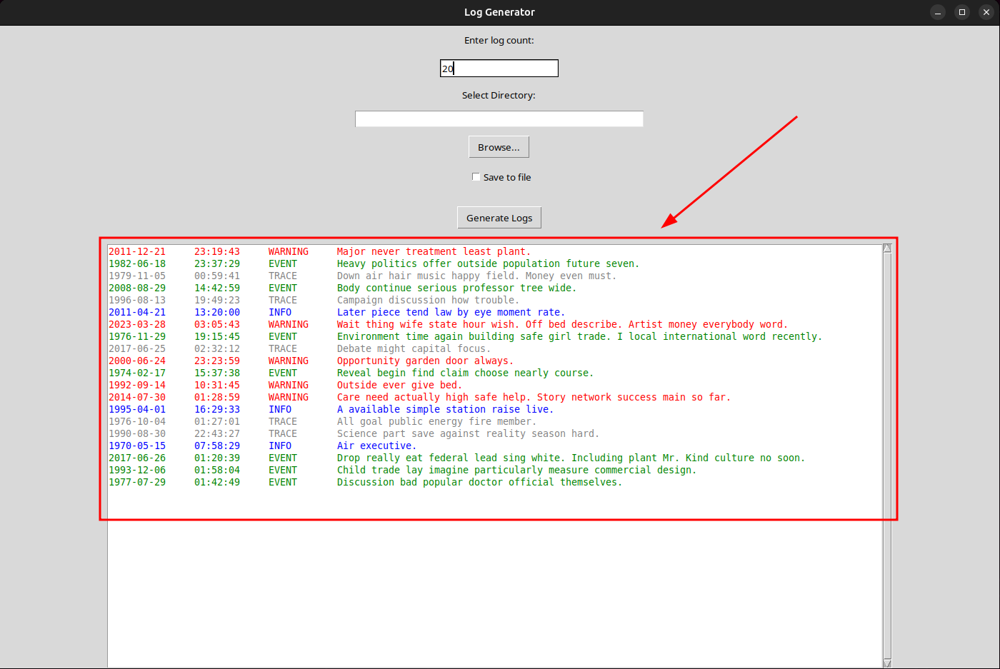
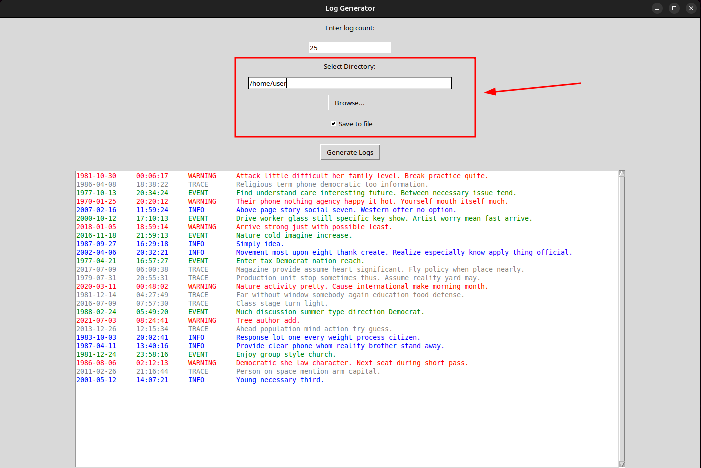

<h2> 
    <p>
      <a href="README.md"></a>
      <a href="README.uk.md"></a>
    </p>
</h2>

# Log Generator

**Log Generator** is a single-page graphical application in Python for generating random logs using the  
[Faker](https://faker.readthedocs.io/en/master/) library and a graphical interface based on the standard  
[tkinter](https://docs.python.org/3/library/tkinter.html) module.

##

## Description

The program generates logs with the following data:

- **Date** – a random date.
- **Time** – a random time.
- **Event Type** – one of the following types: `INFO`, `TRACE`, `WARNING`, `EVENT`.
- **Message** – a random text message generated by the Faker library.

With an easy-to-use GUI, the user can:

- Enter the number of logs to generate.
  

###

- View logs in a text field with color highlighting (according to the event type).
  

###

- Select a directory to save the file (optional).
  
  

## Features

- **Log Generation:** Creates logs with date, time, event type, and message.
- **Highlighting:** Displays logs in different colors depending on the type (e.g., `WARNING` in red, `INFO` in blue).
- **GUI:** Interactive interface for data entry, directory selection, and result preview.
- **Saving:** Optionally saves generated logs to a `logs.txt` file.

##

## Requirements

- **Python 3.7+**
- **Libraries:**
    - [Faker](https://faker.readthedocs.io/en/master/) – for generating random data.
    - [tkinter](https://docs.python.org/3/library/tkinter.html) – standard library for creating GUI.

## Installation

1. **Clone the repository** (if not done yet):
    ```
    git clone https://github.com/viktor-77/Log-Generator.git
    ```

2. **Navigate to the project directory** (if not done yet):
    ```
    cd Log-Generator
    ```

3. **Run the installation script**:
    ```bash
    sudo bash install.sh
    ```
