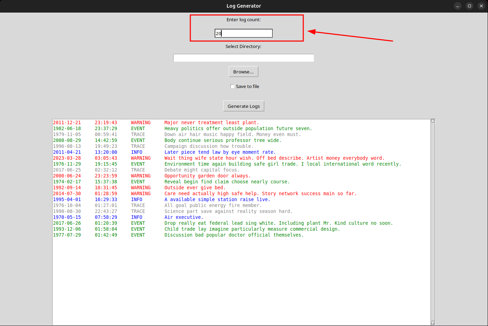
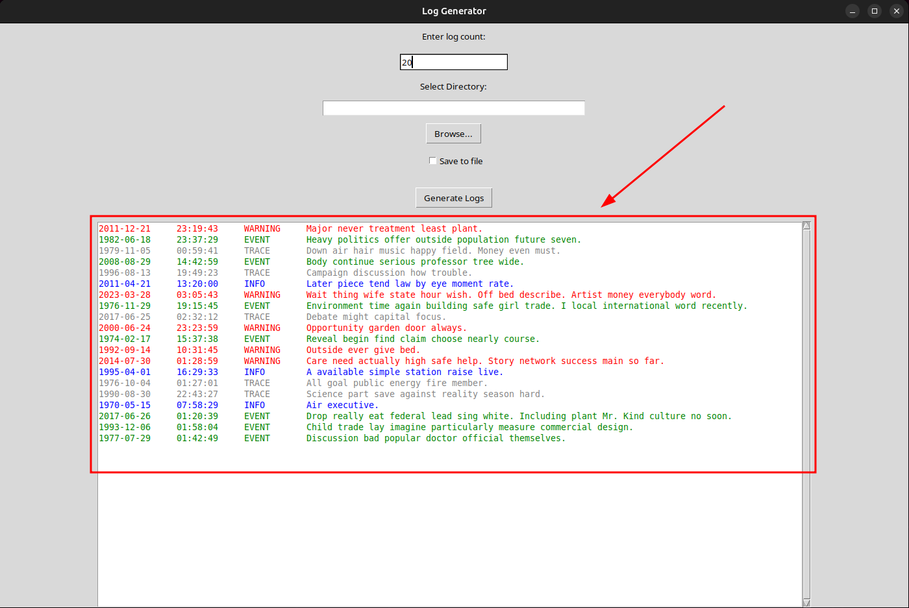
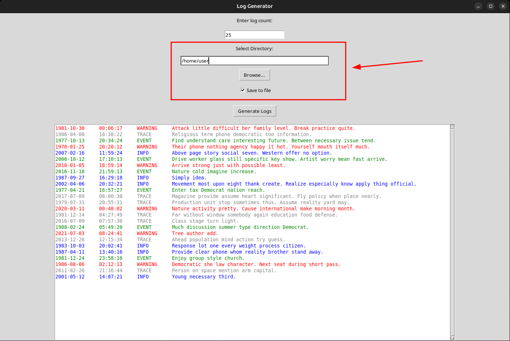
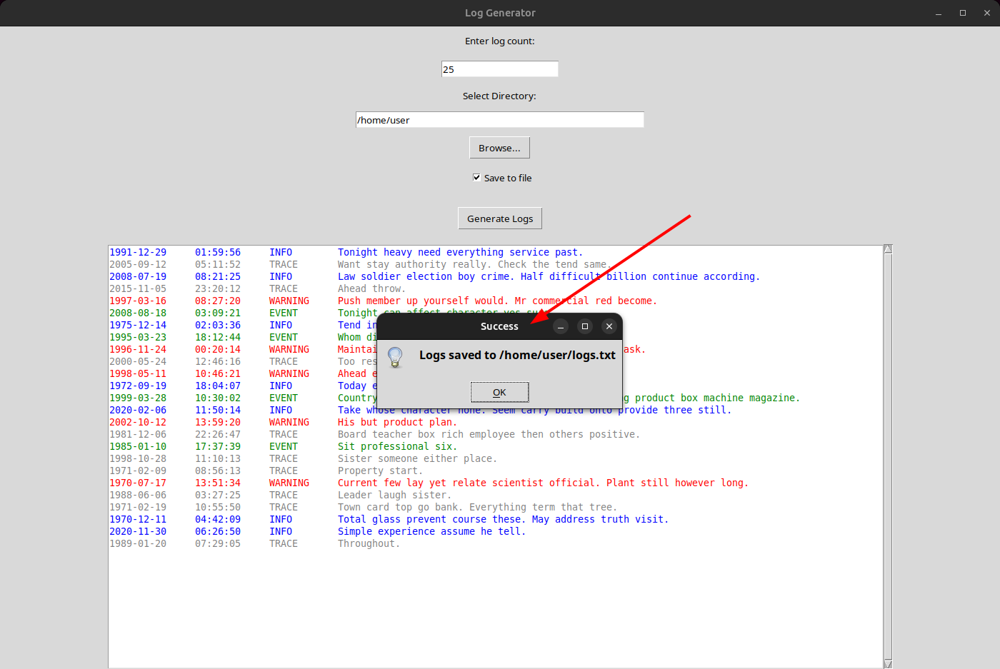

# Log Generator

**Log Generator** – це односторінковий графічний додаток на Python для генерації випадкових логів із використанням
бібліотеки [Faker](https://faker.readthedocs.io/en/master/) та графічного інтерфейсу на базі стандартного
модуля [tkinter](https://docs.python.org/3/library/tkinter.html).

##

## Опис

Програма створює логи з наступними даними:

- **Дата** – випадкова дата.
- **Час** – випадковий час.
- **Тип події** – один із типів: `INFO`, `TRACE`, `WARNING`, `EVENT`.
- **Повідомлення** – випадковий текст, згенерований бібліотекою Faker.

За допомогою зручного GUI користувач може:

- Ввести кількість логів для генерації.
  

###

- Переглядати логи у текстовому полі із кольоровим підсвічуванням (відповідно до типу події).
  

###

- Вибрати директорію для збереження файлу (опціонально).
  
  

## Особливості

- **Генерація логів:** Створення логу із датою, часом, типом події та повідомленням.
- **Підсвічування:** Відображення логів різними кольорами залежно від типу (наприклад, `WARNING` — червоним, `INFO` —
  синім).
- **GUI:** Інтерактивний інтерфейс для введення даних, вибору директорії та перегляду результату.
- **Збереження:** Опціональне збереження згенерованих логів у файл `logs.txt`.

##

## Вимоги

- **Python 3.7+**
- **Бібліотеки:**
    - [Faker](https://faker.readthedocs.io/en/master/) – генерація випадкових даних.
    - [tkinter](https://docs.python.org/3/library/tkinter.html) – стандартна бібліотека для створення GUI.

## Встановлення

1. **Клонування репозиторію** (якщо ще не зроблено):
    ```
    git clone https://github.com/viktor-77/Log-Generator.git
    ```

2. **Перехід до директорії проєкту** (якщо ще не зроблено):
    ```
    cd Log-Generator
    ```

3. **Запуск скрипту встановлення**:
    ```bash
    sudo bash install.sh
    ```


